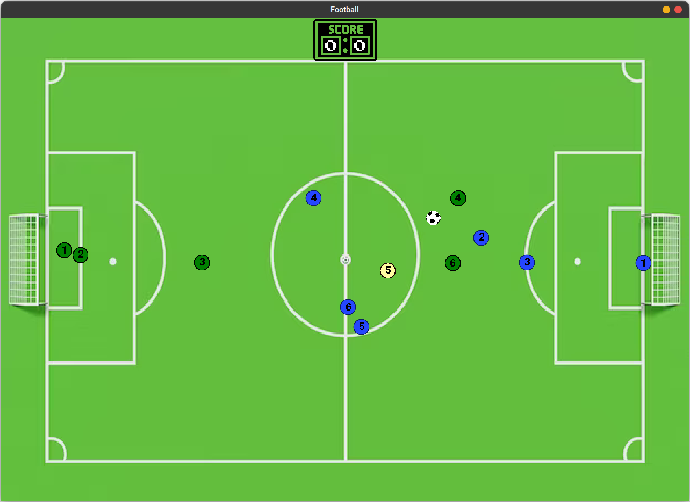

# Football

## Install and run:

<code>git clone https://github.com/disastah2004/python-football.git</code>

## Setting up all requirements:

<code>./install.sh</code>

## Launch

<code>./run.sh</code>

# Gameplay

## Controls

`<ESC>` - Access main menu

`Right mouse button (holding)` - moving in cursor direction

`<Space>` - shooting (does nothing if player without ball)

`1-5` - switching controlled player

---

## Main menu

At the beginning you will face this window:

This is the main game menu. Now there're only 2 options: to start a new game (game will be absolutely new even if you are playing one and accidentely pressed `Esc`) or to exit from app.

---

## Game

Here is a basic lineup (don't blame me, I don't play football at all) You are playing 5 vs 5, everytime you controll only one player in your team (left one). At the start of the game your controlled player is `3`, you can switch player anytime. 

Note that controlled player has slightly higher movement speed

## Out

If the ball goes out of the field, you will see this popup for few seconds and then the ball will be played from the center

## Goal

If your team or your enemy scores a goal, you will have another popup for some time and you will be able to watch last moments before goal (`Replay` button):

---

In the future I'm think of changing bot's behaviour to something more beautiful and enjoyable